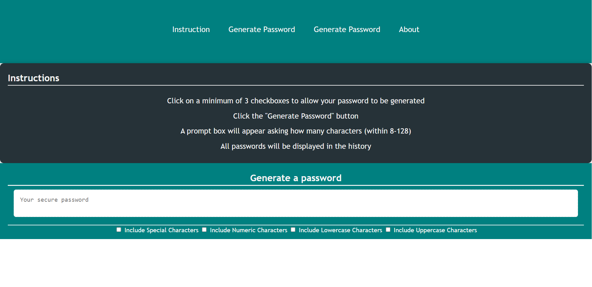
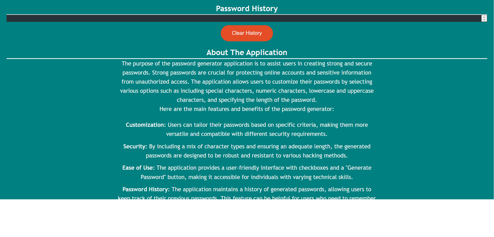

# Password Generator Javascript

The project is modifiying index.js. The code this code creates a password generator that prompts the user for preferences, generates a password based on those preferences, and displays the result on a webpage.

## Table of Contents

- [Description](#description)
- [Screenshot](#screenshot)
- [Deployed Application](#deployed-application)
- [Installation](#installation)

## Description

### Purpose:

The primary purpose of this project is to make the website more accessible for users with disabilities while also optimizing it for search engines. Accessibility is crucial for ensuring that individuals with diverse needs can access and navigate the website using assistive technologies. Moreover, by improving search engine optimization (SEO), the website is likely to rank higher in search engine results, increasing its visibility and reach.

### Features and Changes:

**Button Assignment:**

> A button with the ID 'generate' is assigned to the variable _'generateBtn'._

**Character Set Arrays:**

> Arrays are created for different character sets:
> specialChar for special characters.
> numericChar for numeric characters.
> LowLetterCharc for lowercase alphabetical characters.
> CapsLetterCharc for uppercase alphabetical characters.

**Prompting for Password Options:**

> The getPasswordOptions function is defined to gather user preferences for password generation.
> The user is prompted to input the desired length of the password.
> The input is validated, ensuring it's a number between 8 and 128.
> The user is asked to confirm the inclusion of special characters, numeric characters, lowercase characters, and uppercase characters.
> Validation ensures that at least one character type is selected.
> An object containing the selected options is returned.

**Writing the Password:**

> The writePassword function is defined to generate and display the password.
> It calls getPasswordOptions to get the user's preferences.
> If no options are selected, the function returns.
> The selected character sets are combined into one array.
> A loop generates a password by randomly selecting characters from the combined set based on the desired length.
> The generated password is displayed in the HTML element with the ID 'password'.

**Password Generation:**

> The _generatePassword_ function takes an array and returns a random element from it.

**Event Listener:**

> An event listener is added to the 'generate' button.
> When the button is clicked, it triggers the writePassword function.

## User Story

```
AS AN employee with access to sensitive data
I WANT to randomly generate a password that meets certain criteria
SO THAT I can create a strong password that provides greater security
```

## Screenshot

Include a screenshot or multiple screenshots of your application to give users a visual representation of your project.





## Deployed Application

Link to the live deployment of your application. Make it easy for users to access and explore your project.

[Deployed Application](https://brxwnsugxr.github.io/Password-Generator-with-javascript/#about)

## Installation

Two methods of cloning.

```bash
# Example installation steps
git clone https://github.com/BrxwnSugxr/Password-Generator-with-javascript.git
git clone git@github.com:BrxwnSugxr/Password-Generator-with-javascript.git
cd your-repository
ls file-name
```
